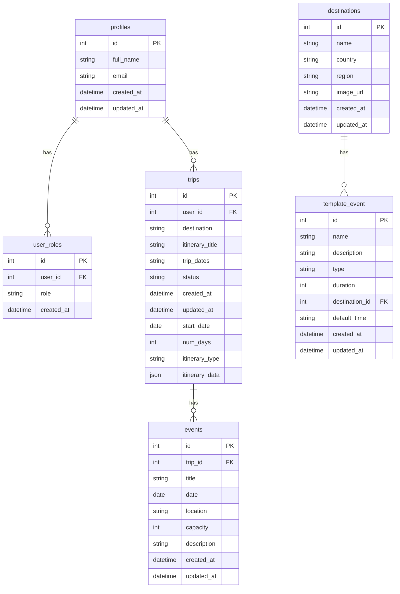
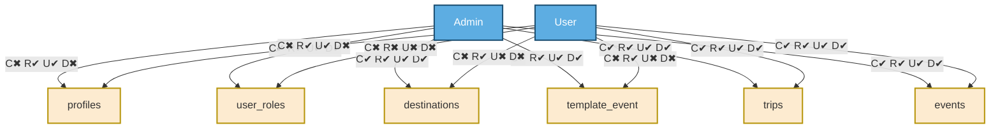

### Admin CRUD Matrix

| Entity          | Create | Read | Update | Delete |
|-----------------|:------:|:----:|:------:|:------:|
| profiles        |   ✖    |  ✔   |   ✔    |   ✖    |
| user_roles      |   ✔    |  ✔   |   ✔    |   ✔    |
| destinations    |   ✔    |  ✔   |   ✔    |   ✔    |
| template_event  |   ✔    |  ✔   |   ✔    |   ✔    |
| trips           |   ✔    |  ✔   |   ✔    |   ✔    |
| events          |   ✔    |  ✔   |   ✔    |   ✔    |

### User CRUD Matrix

| Entity          | Create | Read | Update | Delete |
|-----------------|:------:|:----:|:------:|:------:|
| profiles        |   ✖    |  ✔   |   ✔    |   ✖    |
| user_roles      |   ✖    |  ✖   |   ✖    |   ✖    |
| destinations    |   ✖    |  ✔   |   ✖    |   ✖    |
| template_event  |   ✖    |  ✔   |   ✖    |   ✖    |
| trips           |   ✔    |  ✔   |   ✔    |   ✔    |
| events          |   ✔    |  ✔   |   ✔    |   ✔    |

### App Screen Matrix — CRUD Operations Mapped to Screens

| Entity          | Create (C)                         | Read (R)                                  | Update (U)                                | Delete (D)                                |
|-----------------|------------------------------------|--------------------------------------------|--------------------------------------------|--------------------------------------------|
| **profiles**    | —                                  | Profile Page                               | Profile Edit Page                          | —                                          |
| **user_roles**  | Admin Panel → Manage Roles          | Admin Panel → Manage Roles                 | Admin Panel → Manage Roles                 | Admin Panel → Manage Roles                 |
| **destinations**| Admin Panel → Add Destination       | Home Page / Explore Destinations Page      | Admin Panel → Edit Destination             | Admin Panel → Manage Destinations          |
| **template_event** | Admin Panel → Add Template Event | Admin Panel → Template Event Library       | Admin Panel → Edit Template Event          | Admin Panel → Template Event Library       |
| **trips**       | Create Trip Screen                 | Trips List → Trip Detail Page              | Trip Edit Page                             | Trip Settings → Delete Trip                |
| **events**      | Trip Itinerary Page → Add Event    | Trip Itinerary Page                        | Event Edit Modal / Edit Event Page         | Trip Itinerary Page → Remove Event         |

