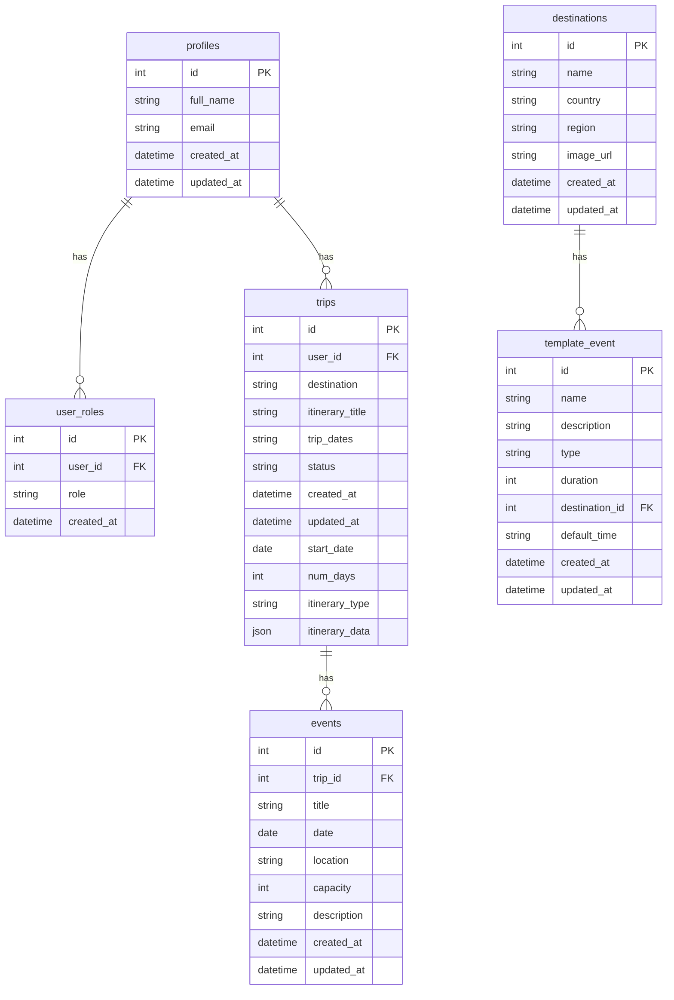

```mermaid
erDiagram

    profiles {
        int id PK
        string full_name
        string email
        datetime created_at
        datetime updated_at
    }

    user_roles {
        int id PK
        int user_id FK
        string role
        datetime created_at
    }

    destinations {
        int id PK
        string name
        string country
        string region
        string image_url
        datetime created_at
        datetime updated_at
    }

    template_event {
        int id PK
        string name
        string description
        string type
        int duration
        int destination_id FK
        string default_time
        datetime created_at
        datetime updated_at
    }

    trips {
        int id PK
        int user_id FK
        string destination
        string itinerary_title
        string trip_dates
        string status
        datetime created_at
        datetime updated_at
        date start_date
        int num_days
        string itinerary_type
        json itinerary_data
    }

    events {
        int id PK
        int trip_id FK
        string title
        date date
        string location
        int capacity
        string description
        datetime created_at
        datetime updated_at
    }

    %% RELATIONSHIPS
    profiles ||--o{ user_roles : has
    profiles ||--o{ trips : has
    destinations ||--o{ template_event : has
    trips ||--o{ events : has
```
